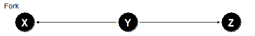
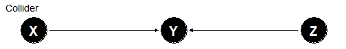

Exploring Causal Models with DAGs
========================================================
author: Ben Hicks
date: 2021-03-16
autosize: true

## Today's menu

### - -  Causal Model review, with toy examples

### - -  Berkeley Admissions Paradox (neat)

### - -  CSU Retention (messy)

Review of DAGs
========================================================
incremental: true

* Represents _causal assumptions_ about the system.
* Structure of the DAG implies _expected association_ in the data.

***

Review of DAGs
========================================================

* Represents _causal assumptions_ about the system.
* Structure of the DAG implies _expected association_ in the data.
  - X -> Y  (open)

***

Review of DAGs
========================================================

* Represents _causal assumptions_ about the system.
* Structure of the DAG implies _expected association_ in the data.
  - X -> Y  (open)
  - Chain: X -> Y -> Z  (open, __mediator__ Y)

***

Review of DAGs
========================================================

* Represents _causal assumptions_ about the system.
* Structure of the DAG implies _expected association_ in the data.
  - X -> Y  (open)
  - Chain: X -> Y -> Z  (open, __mediator__ Y)
  - Fork: X <- Y -> Z (open, __common cause__ Y)

***

Review of DAGs
========================================================

* Represents _causal assumptions_ about the system.
* Structure of the DAG implies _expected association_ in the data.
  - X -> Y  (open)
  - Chain: X -> Y -> Z  (open, __mediator__ Y)
  - Fork: X <- Y -> Z (open, __common cause__ Y)
  - Collider: X -> Y <- Z (closed between X and Z, __collider__ Y)

***

Conditioning - Toy Examples
========================================================
incremental: true

When we _condition_ on a variable it changes the flow of information (association) through the causal model.

## Chain

Student  Capacity -> Doing Work -> Achievement

***

## Fork

Asking Questions <- Motivation -> LMS Activity

Conditioning - Toy Examples
========================================================
incremental: true

## Collider

Educational Support -> Attrition <- Extrinsic Factors

------

The Berkeley Admissions Paradox
=============================================

In 1973 Eugene Hammel noticed that the men got accepted to the graduate school at Berkeley at a rate of 44% whilst women got accepted at a rate of 35%.

Admission decisions were made at a department level, and in each individual department the acceptance rate favoured women over men.

__Was gender discrimination happening?__

----

The Berkeley Admissions Paradox
=============================================

In 1973 Eugene Hammel noticed that the men got accepted to the graduate school at Berkeley at a rate of 44% whilst women got accepted at a rate of 35%.

Admission decisions were made at a department level, and in each individual department the acceptance rate favoured women over men.

__Was gender discrimination happening?__

__How would discrimination (not bias) be represented in the DAG?__

__What arrows would you draw (or more strongly, leave out) from the causal diagram?__

----

Berkeleys Admission Paradox
========================================================

Initial approach?

__What does this model assume?__

__Does this match with the data?__

(Remember, that the results changed when conditioning by department)

-------

Berkeleys Admission Paradox
========================================================
incremental: true

### Model proposed by Peter Bickel

__Does this imply we should condition on department?__

__What happens when we condition on department?__

-------

Berkeleys Admission Paradox
========================================================

### Bickel's model, with conditioning

-----

### Bickel & Hammels conclusions

_The campus as a whole did not engage in discrimination against women applicants_. The total effect of bias against women acceptances is due women applying in greater numbers to departments that are harder to get into.

It is worth noting that discrimination here is the _direct effect_ between __Gender__ and __Outcome__; with all other pathways blocked. Bickel was very careful distinguishing between _bias_ and _discrimination_.

Berkeleys Admission Paradox
========================================================

### Kruskal's alternative

What if there was another variable, such as State of Residence, that influences the Outcome as well?

__What, now, is the consequence of conditioning on Department?__

-----

Berkeleys Admission Paradox
========================================================

### Kruskal's alternative

What if there was another variable, such as State of Residence, that influences the Outcome as well?

__What do we do now?__

-----

Berkeleys Admission Paradox
========================================================

### Kruskal's alternative

What if there was another variable, such as State of Residence, that influences the Outcome as well?

-----

CSU Retention
========================================================

CSU Retention
========================================================

Nice links
========================================================

